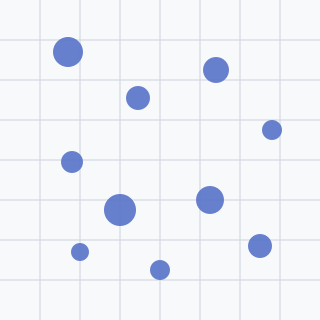
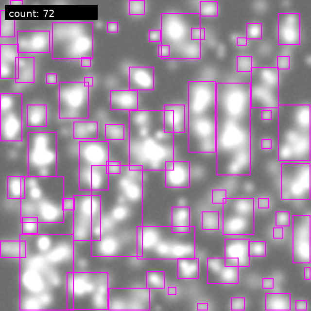

# Cell-counting
 
 Utilities and models for performing automated cell counting using a trained
 SSDLite MobileNetV3 detector.
 
## Project overview

This repository packages the components used to detect and count cells in
hemocytometer images. It bundles the trained SSDLite MobileNetV3 detector,
Python APIs for batch and single-image inference, and an optional Streamlit
application for interactive experimentation. The code mirrors the original
`hepatocytometer.ipynb` workflow while making it easy to install and reuse in
other projects.

## Project overview

This repository packages the components used to detect and count cells in
hemocytometer images. It bundles the trained SSDLite MobileNetV3 detector,
Python APIs for batch and single-image inference, and an optional Streamlit
application for interactive experimentation. The code mirrors the original
`hepatocytometer.ipynb` workflow while making it easy to install and reuse in
other projects.

## Features

- Preconfigured SSDLite MobileNetV3 model wrapper with weight-loading helpers.
- Simple `load_model` and `count_cells` APIs for scripted inference on files or
  Pillow images.
- Batch prediction utilities that export both CSV summaries and annotated
  overlays.
- Streamlit demo that visualises predictions directly in the browser.

## Quickstart

1. Clone the repository and create a virtual environment (recommended).
2. Activate the environment and install the package locally:

   ```bash
   pip install .
   ```

3. Obtain the pretrained detector weights (see below) and place them where you
   intend to load them from (the default is `results/models/best.pt`).
4. Run the Streamlit demo or call the Python API to verify everything is
   working.

### Installing the package locally

Once `pyproject.toml` is available, `pip` can build and install the package
straight from the repository root:

```bash
pip install .
```

For development you can prefer an editable install:

```bash
pip install -e .
```

### Pretrained weights

The examples assume the best-performing weights are stored at
`results/models/best.pt`. If you are starting from a fresh clone:

1. Download the pretrained checkpoint that accompanies the project (for
   example via an internal artifact store) and save it as `best.pt` inside
   `results/models/`.
2. Alternatively, supply a custom path when calling `load_model` or
   `count_cells` if you keep the weights elsewhere.

## Python usage

### Loading the model once

```python
from cell_counting import load_model

model = load_model(
    weights_path="results/models/best.pt",
    device="cuda:0",  # or "cpu"
    image_size=640,
)

count, boxes = model.count_cells("docs/assets/sample_input.svg")
print(f"Detected {count} cells")
```

> **Note:** The packaged SVG is a lightweight illustration; replace the path
> with an actual microscope capture (for example
> `docs/assets/sample_input.jpg`) before running the snippet so that Pillow can
> decode the image.

### One-off predictions with caching

```python
from cell_counting import count_cells

count, boxes, annotated = count_cells(
    "docs/assets/sample_input.svg",
    weights_path="results/models/best.pt",
    device="cpu",
    return_image=True,
    draw=True,
)
annotated.save("prediction.jpg")
print(f"Predicted {count} cells with {len(boxes)} bounding boxes")
```

When experimenting locally, point the API to a raster image (JPG or PNG).
Providing the illustrative SVG is handy for documentation, but inference should
use the corresponding bitmap capture to mirror real workflows.

## Streamlit app


- Preconfigured SSDLite MobileNetV3 model wrapper with weight-loading helpers.
- Simple `load_model` and `count_cells` APIs for scripted inference on files or
  Pillow images.
- Batch prediction utilities that export both CSV summaries and annotated
  overlays.
- Streamlit demo that visualises predictions directly in the browser.

## Quickstart

1. Clone the repository and create a virtual environment (recommended).
2. Activate the environment and install the package locally:

   ```bash
   pip install .
   ```

3. Obtain the pretrained detector weights (see below) and place them where you
   intend to load them from (the default is `results/models/best.pt`).
4. Run the Streamlit demo or call the Python API to verify everything is
   working.

### Installing the package locally

Once `pyproject.toml` is available, `pip` can build and install the package
straight from the repository root:

```bash
pip install .
```

For development you can prefer an editable install:

```bash
pip install -e .
```

### Pretrained weights

The examples assume the best-performing weights are stored at
`results/models/best.pt`. If you are starting from a fresh clone:

1. Download the pretrained checkpoint that accompanies the project (for
   example via an internal artifact store) and save it as `best.pt` inside
   `results/models/`.
2. Alternatively, supply a custom path when calling `load_model` or
   `count_cells` if you keep the weights elsewhere.

## Python usage

### Loading the model once

```python
from cell_counting import load_model

model = load_model(
    weights_path="results/models/best.pt",
    device="cuda:0",  # or "cpu"
    image_size=640,
)

count, boxes = model.count_cells("docs/assets/sample_input.jpg")
print(f"Detected {count} cells")
```

### One-off predictions with caching

```python
from cell_counting import count_cells

count, boxes, annotated = count_cells(
    "docs/assets/sample_input.jpg",
    weights_path="results/models/best.pt",
    device="cpu",
    return_image=True,
    draw=True,
)
annotated.save("prediction.jpg")
print(f"Predicted {count} cells with {len(boxes)} bounding boxes")
```


The app lets you upload hemocytometer imagery, tweak confidence thresholds, and
inspect detections without writing code.

## Examples

The repository includes lightweight SVG illustrations to keep the pull request
binary-free while still conveying what the model expects and produces. Replace
them with your own microscope captures if you need true photographs in local
documentation.

| Sample hemocytometer input | Annotated output from `count_cells` |
| --- | --- |
|  |  |

The annotated output was generated by calling `cell_counting.count_cells` with
`return_image=True`, which draws bounding boxes and overlays the predicted cell
count. When sharing real examples, place the source image at
`docs/assets/sample_input.jpg` (or another format of your choice) and update the
table accordingly.


## Evaluation

Validation results bundled with the repository show the detector remains close
to ground-truth counts: across three validation frames the model attains a mean
absolute error of 1.33 cells (median 1, maximum 2) while predicting 18 cells
versus 16 labelled cells overall. See `results/report_val.csv` for the full
per-image breakdown.
