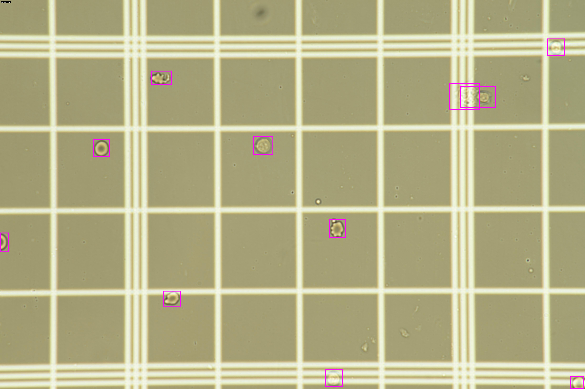
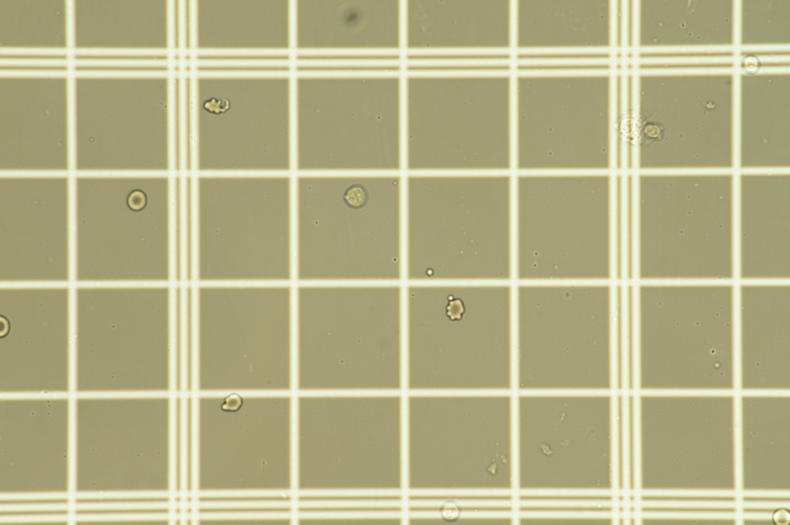

# Cell-counting
 
Utilities and models for automated cell counting with the RetinaNet
(ResNet-50 FPN) detector that powers the production notebooks.



<p align="center">
  <a href="#"></a>
  <a href="#"></a>
</p>

## TODO

### UI interface _(assigned to S.Yeon)_

- [v] Provide an entry point to choose between a live microscope feed and an
      imported image for cell counting.
- [ ] Integrate direct interpretation from a connected microscope adapter.
- [ ] Enable real-time region selection while viewing the microscope feed.
- [ ] Invoke the counting model and present a fixed annotated image along with
      the predicted count (no live overlay required).
- [ ] Allow users to add or remove bounding boxes and update the cell count
      interactively.
- [ ] Support exporting the analysed image, mirroring the workflow for imported
      images.

## 📑 Table of Contents
- [TODO](#todo)
- [Project Overview](#project-overview)
- [Features](#features)
- [Quickstart](#quickstart)
- [Python Usage](#python-usage)
- [Streamlit App](#streamlit-app)
- [Additional Resources](#additional-resources)
- [Evaluation](#evaluation)
- [Examples](#examples)

## Project overview

This repository packages everything needed to detect and count cells in
hemocytometer images. It bundles trained RetinaNet weights, Python helpers for
single or batch inference, and a Streamlit app for interactive experimentation.
The implementation mirrors the original `hepatocytometer.ipynb` workflow while
remaining easy to install and extend.

## Features

- RetinaNet (ResNet-50 FPN) wrapper with convenient weight-loading helpers.
- `load_model` and `count_cells` APIs for scripted inference on files or Pillow
  images.
- Batch prediction utilities that export CSV summaries and annotated overlays.
- Streamlit demo that visualises predictions directly in the browser.

## Quickstart

1. Clone the repository and move into the project directory.

   ```bash
   git clone https://github.com/<your-org>/Cell-counting.git
   cd Cell-counting
   ```

2. (Optional) Create and activate a virtual environment.
3. Install runtime dependencies.

   ```bash
   pip install -r requirements.txt
   ```

4. Download the pretrained detector weights and place them in
   `results/models/best.pt` (or provide a custom path when loading the model).
5. Run the Streamlit demo or use the Python API to confirm the setup.

## Python usage

```python
from cell_counting import count_cells, load_model

model = load_model(
    weights_path="results/models/best.pt",
    device="cuda:0",  # or "cpu"
    image_size=640,
)

count, boxes, annotated = count_cells(
    "docs/assets/seq0432_jpg.rf.f16687b29f969b08fdc2900f51b3e5d3.jpg",
    weights_path="results/models/best.pt",
    blank_image="path/to/blank_reference.jpg",  # optional
    return_image=True,
    draw=True,
)
annotated.save("prediction.jpg")
print(f"Detected {count} cells across {len(boxes)} boxes")
```

Tips:

- Provide a blank reference frame to remove background artefacts when
  necessary.
- Adjust `conf`, `nms_iou`, `size_min`, and `size_max` to tailor detections to
  your imagery.
- Use `cell_counting.inference.predict_folder(...)` for batch processing with
  CSV summaries and annotated overlays.

## Streamlit app

After installing dependencies and downloading the trained weights, launch the
interactive demo from the project root:

```bash
streamlit run streamlit_app.py
```

Use the sidebar to select checkpoints, upload microscope imagery, adjust
thresholds, toggle blank-frame subtraction, and download annotated results
without writing code.

## Additional resources

- `hepatocytometer.ipynb` &mdash; original exploratory notebook with the training
  and evaluation workflow.
- `docs/` &mdash; documentation assets, including sample images referenced in this
  README.
- `results/` &mdash; suggested directory layout for storing trained models and
  experiment outputs.

## Evaluation

Validation results bundled with the repository show that the detector predicts
counts very close to the ground truth. Across three validation frames, the
model recorded a mean absolute error of 1.33 cells (median 1, maximum 2). In
total it predicted 18 cells against 16 labelled cells. Per-image details are
available in `results/report_val.csv`.

## Model architecture diagram

Render the RetinaNet overview diagram (matching `cell_counting/model.py`) with:

```bash
python docs/scripts/render_model_diagram.py --compile
```

The TikZ source is saved to `docs/assets/retinanet_architecture.tex`; when
LaTeX is available, the script also produces a PDF.

Refer to the [tests](tests/) folder for smoke tests that validate the package
installation and inference utilities.

## Examples

The example assets live in `docs/assets/` as conventional JPG and PNG files so
you can inspect them directly or reuse them in your own experiments. The input
frame below matches the microscope crop supplied for this task and the
accompanying output shows the resulting overlay. The helper script
`docs/scripts/generate_examples.py` (which falls back to a lightweight
threshold-based segmentation when PyTorch is unavailable) regenerates both
artifacts from the source imagery and keeps the repository reproducible.

| Sample hemocytometer input | Annotated output |
| --- | --- |
|  |  |

The repository inference helpers (`cell_counting.count_cells` or
`cell_counting.inference.predict_image`) will recreate the overlay when PyTorch
is available. In environments where the heavy dependencies cannot be installed,
the regeneration script resorts to intensity-based segmentation to draw
bounding boxes so that the documentation remains illustrative.

